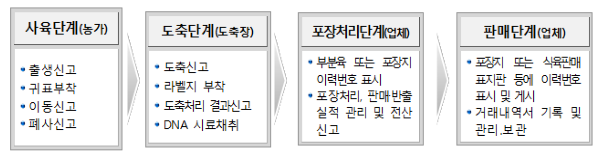

# 블록체인을 활용한 축산물 이력제 시스템
블록체인을 활용한 축산물 이력제 시스템

## 프로젝트 설명
  - 축산물 이력제도는 농림축산식품부 산하의 축산물 품질 관리 본부에서 운영 관리하는 제도로서 축산물의 출생･수입 등 사육과 축산물의 생산･수입부터 판매에 이르기까지 각 단계별로 정보를 기록･관리함으로써 가축과 축산물의 이동경로를 관리하여, 방역의 효율성을 도모하고 축산물의 안전성 확보 및 소비자 안심을 위한 제도이다. 이 제도는 가축 및 축산물 이력관리에 필요한 사항을 각 단계별로 기록･관리하고 해당 개체 또는 축산물에 표시
  - 본 프로젝트는 농가/도축사/유통사가 축산물에 대한 이력 정보를 블록체인으로 관리해주도록 하는 프로젝트
  
  
## 문제점
  - 축산물 이력제는 대한민국 정부가 법률로 정하여 의무화 하였고 대부분의 축산 농가의 적극적인 협조로 안정적으로 유지해오고 있음은 사실이다. 하지만, 몇몇 축산 농가의 고의적인 신고 누락/신고 편집 등의 이유로 여전히 매년 일제 조사 등을 통해 꾸준히 관리하고 있는 것이 현실이다.
  - 2017년 피프로닐 사건이 있었는데, 살충제 사료를 먹인 닭이 낳은 달걀이 유통이 되어 사회적으로 엄청난 이슈가 되었지만, 실상 얼마나 유통이 되었고, 어디로 유통이 되었는지 조차도 파악이 안되는 문제가 발생.

## 해결 방안
  - 블록체인 기술을 활용하여 농가/유통사/도축사에서 기 입력한 Data를 삭제하거나 수정하는 경우를 원천적으로 막으려 함.
  - 본 프로젝트는 축산물의 탄생/양도/양수/도축/유통 등의 모든 과정을 자동화 시스템으로 관리하여 모든 데이터는 자동으로 관리할 수 있도록 함.
  - 본 프로젝트는 정부 주도의 프로젝트이며, 법으로 운영되고 있기에 모든 사항은 강제할 수 있음.

## 토큰 이코노믹

